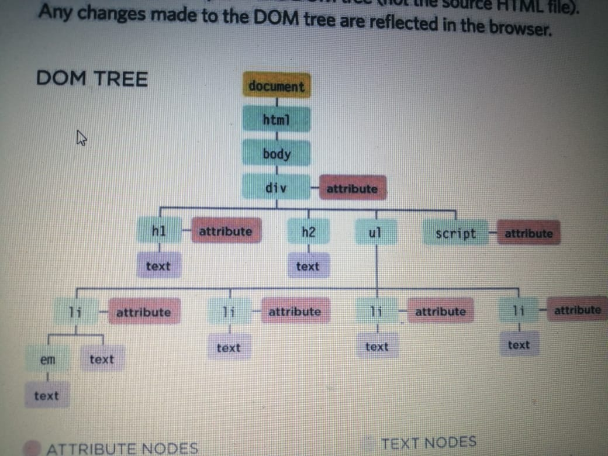

# WHAT IS AN OBJECT? 
Objects group together a set of variables and functions to create a model
of a something you would recognize from the real world. In an object,
variables and functions take on new names. 
## In JavaScript:
• Variables have a name and you can assign them a
value of a string, number, or Boolean.
• Arrays have a name and a group of values. (Each
item in an array is a name/value pair because it
has an index number and a value.)
• Named functions have a name and value that is a
set of statements to run if the function is called.
• Objects consist of a set of name/value pairs
(but the names are referred to as keys)
---
This example starts by creating
an object using literal notation.
This object is called hotel which
represents a hotel called Quay
with 40 rooms (25 of which have
been booked).
Next, the content of the page
is updated with data from this
object. It shows the name of the
hotel by accessing the object's
name property and the number
of vacant rooms using the
checkAvail ability() method.
To access a property of this
object, the object name is
followed by a dot (the period
symbol) and the name of the
property that you want.
Similarly, to use the method,
you can use the object name
followed by the method name.
hotel . checkAvailability()
If the method needs parameters,
you can supply them in the
parentheses (just like you can
pass arguments to a function). 
---

### THE DOM TREE IS A MODEL OF A WEB PAGE 

As a browser loads a web page, it creates a model of that page.
The model is called a DOM tree, and it is stored in the browsers' memory.
It consists of four main types of 

BODY OF HTML 

```
<html>
<body>
<di v id="page">
<hl id="header">List</hl>
<h2>Buy groceries</h2>
<ul >
<li id="one" class="hot"><em>fresh</em> figs</li>
<li id="two" class="hot">pine nuts</l i>
<l i id="three" class="hot">honey</l i >
<l i id="four">balsamic vinegar</l i>
</ ul >
<script src="js/l i st.js "></scri pt>
</ div>
</ body>
</ html >
```


---

# COMPARING TECHNIQUES: UPDATING HTML CONTENT 


DISADVANTAGES

• It only works when the page initially loads.
• If you use it after the page has loaded it can:
1. Overwrite the whole page
2. Not add the content to the page
3. Create a new page

• It can cause problems with XHTML pages that
are strictly validated.

• This method is very rarely used by programmers
these days and is generally frowned upon. 

ADVANTAGES

• It is a quick and easy way to show beginners how
content can be added to a page.

# Summary 
1. nThe browser represents the page using a DOM tree.
2. DOM trees have four types of nodes: document nodes,
element nodes, attribute nodes, and text nodes.
3. You can select element nodes by their id or cl ass
attributes, by tag name, or using CSS selector syntax.
4. Whenever a DOM query can return more than one
node, it will always return a Nadel i st.
5 From an element node, you can access and update its
content using properties such as textContent and
i nnerHTML or using DOM manipulation techniques.
6. An element node can contain multiple text nodes and
child elements that are siblings of each other.
7. In older browsers, implementation of the DOM is
inconsistent (and is a popular reason for using jQuery).
Browsers offer tools for viewing the DOM tree . 