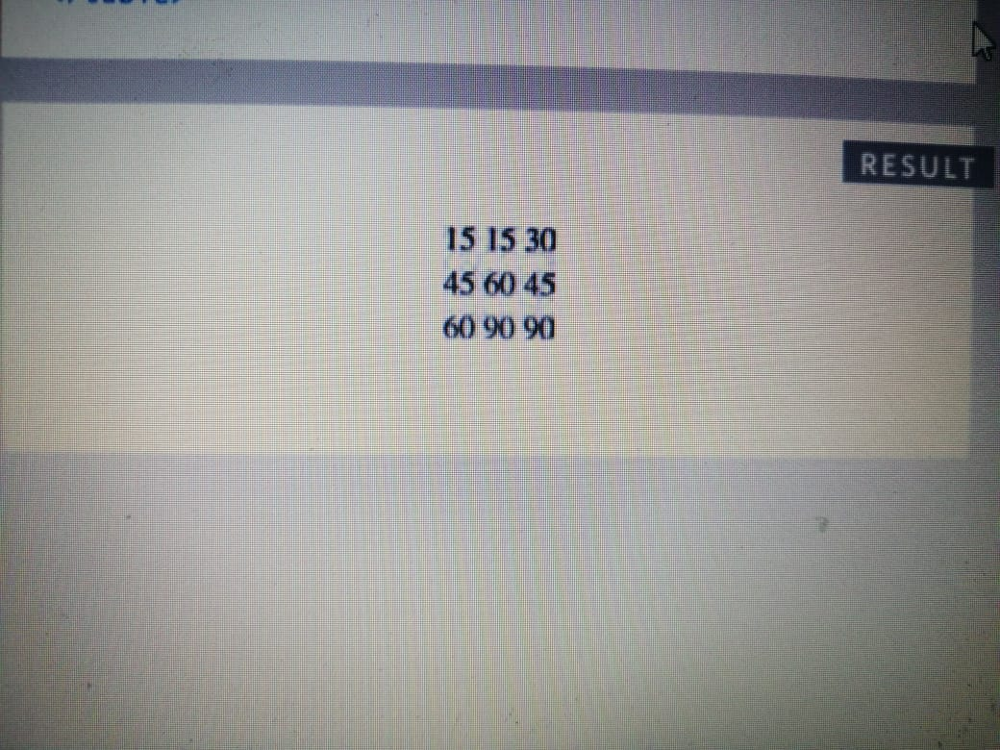

# What's a Table? 
It contains the results of data or private information and is defined in an organized and networked manner

# Basic Table Structure:
`<table>` The `<table>` element is used
to create a table. The contents
of the table are written out row
by row.

`<tr>` You indicate the start of each
row using the opening `<tr>` tag.
(The tr stands for table row.)
It is followed by one or more
`<td>` elements (one for each cell
in that row).
At the end of the row you use a
closing `</tr>` tag.

`<td>`Each cell of a table is
represented using a `<td>`
element. (The td stands for
table data.)

```
<table>
 <tr>
 <td>15</td>
 <td>15</td>
 <td>30</td>
 </tr>
 <tr>
 <td>45</td>
 <td>60</td>
 <td>45</td>
 </tr>
 <tr>
 <td>60</td>
 <td>90</td>
 <td>90</td>
 </tr>
</table>
```


----

# Table Headings

The `<th>` element is used just
like the `<td>` element but its
purpose is to represent the
heading for either a column or
a row. (The th stands for table
heading.) 

# Long Tables
- The headings of the table should
sit inside the `<thead>` element

- The body should sit inside the
`<tbody>` element.
 
 
The footer belongs inside the
`<tfoot>` element
```
<table>
 <thead>
 <tr>
 <th>Date</th>
 <th>Income</th>
 <th>Expenditure</th>
 </tr>
 </thead>
 <tbody>
 <tr>
 <th>1st January</th>
 <td>250</td>
 <td>36</td>
 </tr>
 <tr>
 <th>2nd January</th>
 <td>285</td>
 <td>48</td>
 </tr>
 <!-- additional rows as above -->
 <tr>
 <th>31st January</th>
 <td>129</td>
 <td>64</td>
 </tr>
 </tbody>
 <tfoot>
 <tr>
 <td></td>
 <td>7824</td>
 <td>1241</td>
 </tr>
 </tfoot>
</table>
```
# Summary TABLES
- The `<table>` element is used to add tables to a web
page.
-  A table is drawn out row by row. Each row is created
with the `<tr>` element.
-  Inside each row there are a number of cells
represented by the `<td>` element (or `<th>` if it is a
header).
-  You can make cells of a table span more than one row
or column using the rowspan and colspan attributes.
-  For long tables you can split the table into a `<thead>`,
`<tbody>`, and `<tfoot>`.
----
#js

- Functions allow you to group a set of related
statements together that represent a single task.
- Functions can take parameters (informatiorJ required
to do their job) and may return a value.
- An object is a series of variables and functions that
represent something from the world around you.
- In an object, variables are known as properties of the
object; functions are known as methods of the object.
- Web browsers implement objects that represent both
the browser window and the document loaded into the
browser window.
- JavaScript also has several built-in objects such as
String, Number, Math, and Date. Their properties and
methods offer functionality that help you write scripts.
- Arrays and objects can be used to create complex data
sets (and both can contain the other). 