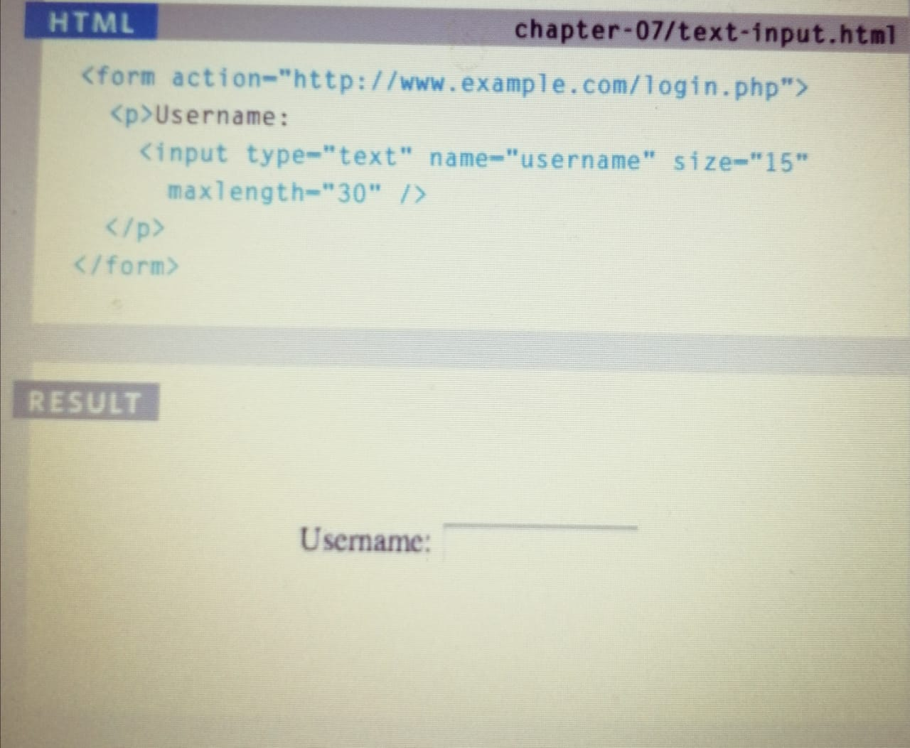
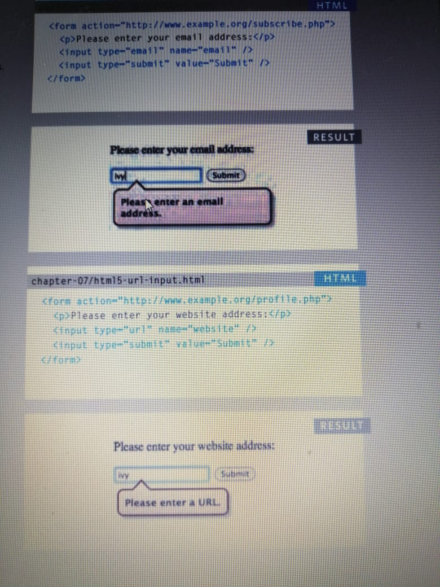

# Again, let's learn more, this time with Forms

Form Structure:
Form controls live inside a
`<form>` element. This element
should always carry the action
attribute and will usually have a
method and id attribute too.

```
<form action="http://www.example.com/subscribe.php"
method="get">
```
`<input>`
The `<input>` element is used
to create several different form
controls. The value of the type
attribute determines what kind
of input they will be creating

### type="text" 
- When the type attribute has a
value of text, it creates a singleline text input.



# Also we have 

Radio Button

Text Are

Radio Button

Checkbox

Drop Down List Box

Multiple Select Box

 Email & URL Input:
 
 `<input>`
HTML5 has also introduced
inputs that allow visitors to
enter email addresses and URLs.
Browsers that do not support
these input types will just treat
them as text boxes.

`type="email"`
If you ask a user for an email
address, you can use the email
input. Browsers that support
HTML5 validation will check
that the user has provided
information in the correct format
of an email address. Some smart
phones also optimize their
keyboard to display the keys you
are most likely to need when
entering an email address 

`type="url"`
A URL input can be used when
you are asking a user for a web
page address. Browsers that
support HTML5 validation will
check that the user has provided
information in the format of
a URL. Some smart phones
also optimize their keyboard to
display the keys you are most
likely to need when entering a
URL.



`Example fORMS`
```
<html>
<head>
 <title>Forms</title>
</head>
<body>
 <form action="http://www.example.com/review.php" method="get">
 <fieldset>
 <legend>
 Your Details:
 </legend>
 <label>
 Name:
 <input type="text" name="name" size="30" maxlength="100">
 </label>
 <br />
 <label>
 Email:
 <input type="email" name="email" size="30" maxlength="100">
 </label>
 <br />
 </fieldset>
 <br />
 <fieldset>
 <legend>
 Your Review:
 </legend>
 <p>
 <label for="hear-about">
 How did you hear about us?
 </label>
 <select name="referrer" id="hear-about">
 <option value="google">Google</option>
 <option value="friend">Friend</option>
 <option value="advert">Advert</option>
 <option value="other">Other</option>
 </select>
 </p>
 <p>
 ```

## Conclude

 - Whenever you want to collect information from
visitors you will need a form, which lives inside a
`<form>` element.
-  Information from a form is sent in name/value pairs.
-  Each form control is given a name, and the text the
user types in or the values of the options they select
are sent to the server.
-  HTML5 introduces new form elements which make it
easier for visitors to fill in forms.